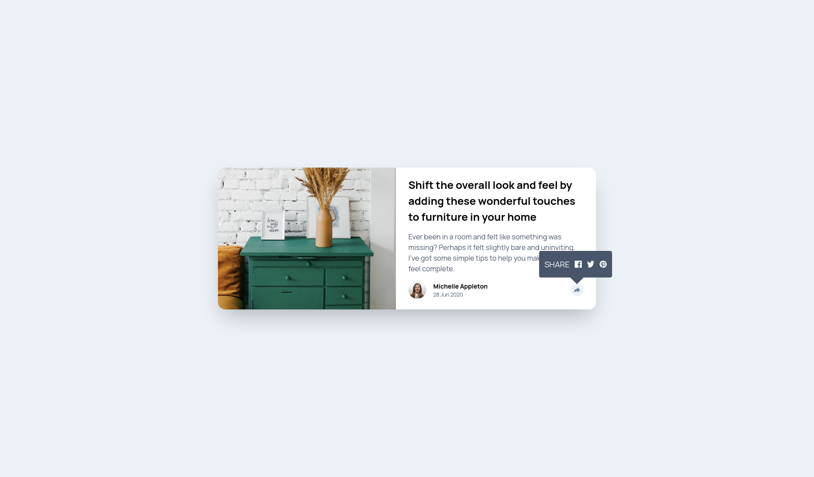

# Frontend Mentor - Article preview component solution

This is a solution to the [Article preview component challenge on Frontend Mentor](https://www.frontendmentor.io/challenges/article-preview-component-dYBN_pYFT). Frontend Mentor challenges help you improve your coding skills by building realistic projects.

## Table of contents

- [Frontend Mentor - Article preview component solution](#frontend-mentor---article-preview-component-solution)
  - [Table of contents](#table-of-contents)
  - [Overview](#overview)
    - [Screenshot](#screenshot)
    - [Links](#links)
  - [My process](#my-process)
    - [Built with](#built-with)
    - [What I learned](#what-i-learned)
    - [Continued development](#continued-development)
    - [Useful resources](#useful-resources)
  - [Author](#author)

## Overview

### Screenshot

### Links

- Solution URL: [GitHub Repository](https://github.com/FraVelz/Frontend-Mentor/tree/main/article-preview-component)
- Live Site URL: [GitHub Pages](https://fravelz.github.io/Frontend-Mentor/article-preview-component/)

## My process

### Built with

- Semantic HTML5 markup
- Tailwind CSS (CDN, v4 browser build)
- Custom CSS (design tokens and layout in a `<style>` block)
- Google Fonts (Manrope)
- Vanilla JavaScript (toggle for the share panel on mobile and desktop)

### What I learned

Built the article preview card with responsive layout, share controls, and transitions, following the Frontend Mentor design and style guide.

### Continued development

Keep practicing with more Frontend Mentor challenges and refine accessibility and responsive design.

### Useful resources

- [Frontend Mentor](https://www.frontendmentor.io/)
- [Tailwind CSS](https://tailwindcss.com/)

## Author

- Frontend Mentor - [@Fravelz](https://www.frontendmentor.io/profile/FraVelz)
