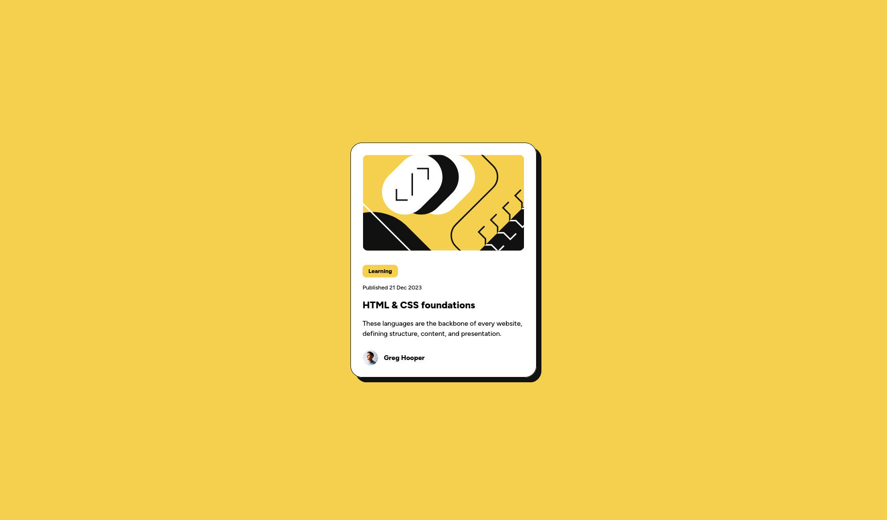

# Frontend Mentor - Blog preview card solution

This is a solution to the [Blog preview card challenge on Frontend Mentor](https://www.frontendmentor.io/challenges/blog-preview-card-ckPaj01IcS). Frontend Mentor challenges help you improve your coding skills by building realistic projects.

## Table of contents

- [Frontend Mentor - Blog preview card solution](#frontend-mentor---blog-preview-card-solution)
  - [Table of contents](#table-of-contents)
  - [Overview](#overview)
    - [Screenshot](#screenshot)
    - [Links](#links)
  - [My process](#my-process)
    - [Built with](#built-with)
    - [What I learned](#what-i-learned)
    - [Continued development](#continued-development)
    - [Useful resources](#useful-resources)
  - [Author](#author)

## Overview

### Screenshot

### Links

- Solution URL: [GitHub Repository](https://github.com/FraVelz/Frontend-Mentor/tree/main/blog-preview-card)
- Live Site URL: [GitHub Pages](https://fravelz.github.io/Frontend-Mentor/blog-preview-card/)

## My process

### Built with

- Semantic HTML5 markup
- CSS custom properties
- Mobile-first workflow

### What I learned

Build the component using HTML, CSS, without a framework, following the typical Frontend Mentor workflow.

### Continued development

Keep practicing with more Frontend Mentor challenges and refine accessibility and responsive design.

### Useful resources

- [Frontend Mentor](https://www.frontendmentor.io/)

## Author

- Frontend Mentor - [@Fravelz](https://www.frontendmentor.io/profile/FraVelz)
