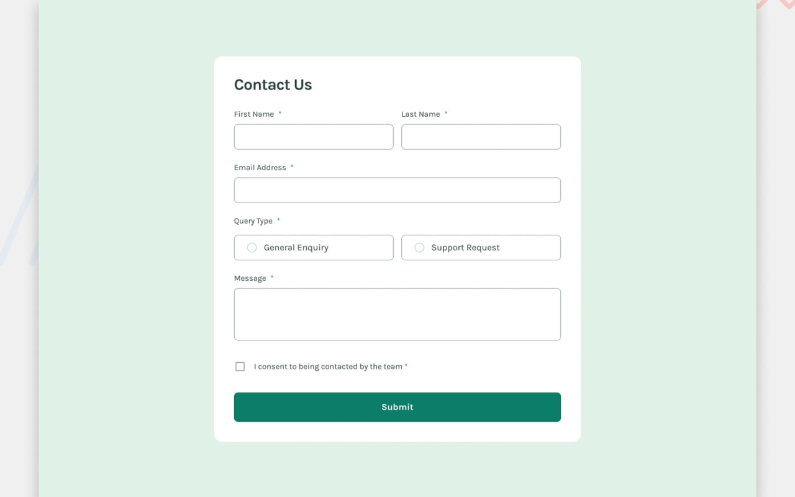

# Frontend Mentor - Contact form solution

This is a solution to the [Contact form challenge on Frontend Mentor](https://www.frontendmentor.io/challenges/contact-form--G-hYlqKJj). Frontend Mentor challenges help you improve your coding skills by building realistic projects.

## Table of contents

- [Frontend Mentor - Contact form solution](#frontend-mentor---contact-form-solution)
  - [Table of contents](#table-of-contents)
  - [Overview](#overview)
    - [Screenshot](#screenshot)
    - [Links](#links)
  - [My process](#my-process)
    - [Built with](#built-with)
    - [What I learned](#what-i-learned)
    - [Continued development](#continued-development)
    - [Useful resources](#useful-resources)
  - [Author](#author)

## Overview

### Screenshot

### Links

- Solution URL: [GitHub Repository](https://github.com/FraVelz/Frontend-Mentor/tree/main/contact-form)
- Live Site URL: [GitHub Pages](https://fravelz.github.io/Frontend-Mentor/contact-form/)

## My process

### Built with

- Semantic HTML5 markup
- Tailwind CSS (CDN, v4 browser build)
- Custom CSS (`extras.css` for error and success-toast layout)
- Vanilla JavaScript (client-side validation, success message on valid submit)

### What I learned

Implemented required-field and email checks, query-type radios, and consent, with inline error text and a fixed success message after a valid submission, keeping focus-friendly patterns for the form controls.

### Continued development

Tighten email validation to match `type="email"` behavior and refine screen-reader announcements for errors and the success state.

### Useful resources

- [MDN: Form data validation](https://developer.mozilla.org/en-US/docs/Learn/Forms/Form_validation)
- [Tailwind CSS](https://tailwindcss.com/)
- [Frontend Mentor](https://www.frontendmentor.io/)

## Author

- Frontend Mentor - [@Fravelz](https://www.frontendmentor.io/profile/Fravelz)
