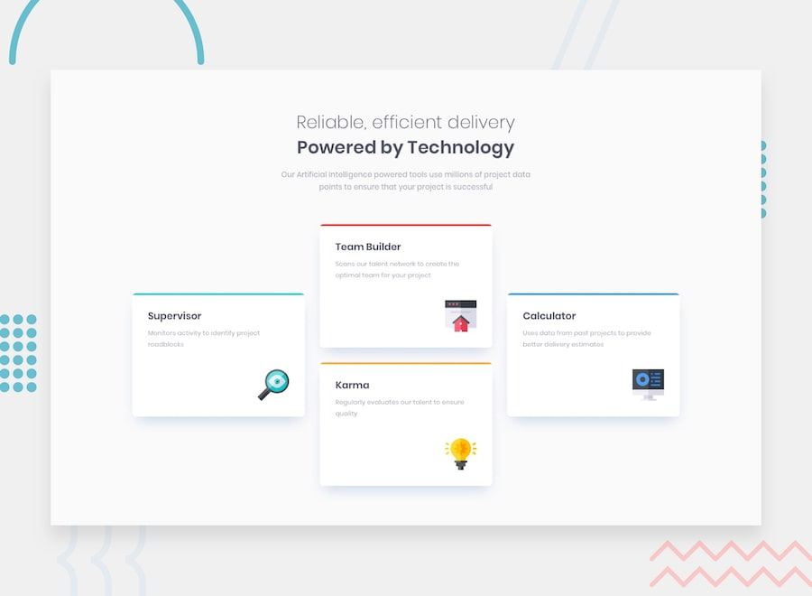

# Frontend Mentor - Four card feature section solution

This is a solution to the [Four card feature section challenge on Frontend Mentor](https://www.frontendmentor.io/challenges/four-card-feature-section-weK1eFYK). Frontend Mentor challenges help you improve your coding skills by building realistic projects.

## Table of contents

- [Frontend Mentor - Four card feature section solution](#frontend-mentor---four-card-feature-section-solution)
  - [Table of contents](#table-of-contents)
  - [Overview](#overview)
    - [Screenshot](#screenshot)
    - [Links](#links)
  - [My process](#my-process)
    - [Built with](#built-with)
    - [What I learned](#what-i-learned)
    - [Continued development](#continued-development)
    - [Useful resources](#useful-resources)
  - [Author](#author)

## Overview

### Screenshot

### Links

- Solution URL: [GitHub Repository](https://github.com/FraVelz/Frontend-Mentor/tree/main/four-card-feature-section)
- Live Site URL: [GitHub Pages](https://fravelz.github.io/Frontend-Mentor/four-card-feature-section/)

## My process

### Built with

- Semantic HTML5 markup
- Tailwind CSS (browser build via CDN)
- Custom CSS (`styles/fonts.css`) for typography
- Google Fonts (Poppins)
- Mobile-first workflow

### What I learned

Build the four-card feature layout using HTML, Tailwind CSS, and small custom styles for headings and body copy, following the typical Frontend Mentor workflow.

### Continued development

Keep practicing with more Frontend Mentor challenges and refine accessibility and responsive design.

### Useful resources

- [Poppins - Google Fonts](https://fonts.google.com/specimen/Poppins)
- [Frontend Mentor](https://www.frontendmentor.io/)

## Author

- Frontend Mentor - [@Fravelz](https://www.frontendmentor.io/profile/FraVelz)
