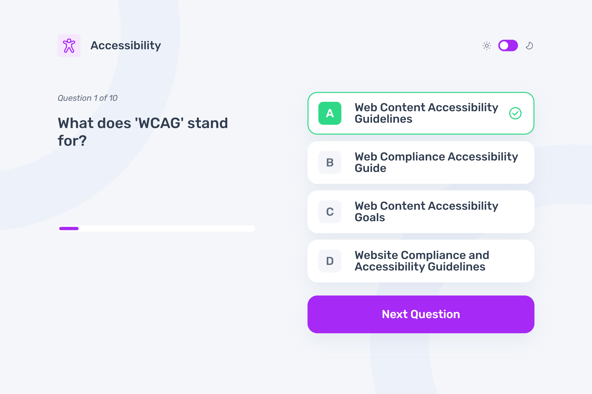

# Frontend Mentor - Frontend quiz app solution

This is a solution to the [Frontend quiz app challenge on Frontend Mentor](https://www.frontendmentor.io/challenges/frontend-quiz-app-BE7xkzXQnU). Frontend Mentor challenges help you improve your coding skills by building realistic projects.

## Table of contents

- [Overview](#overview)
  - [Screenshot](#screenshot)
  - [The challenge](#the-challenge)
  - [Links](#links)
- [Local preview](#local-preview)
- [My process](#my-process)
  - [Built with](#built-with)
  - [Useful resources](#useful-resources)
- [Author](#author)

## Overview

### Screenshot

### The challenge

Pick a subject, answer with one of four options, get validation and feedback, move through the quiz, see a final score, play again, switch light/dark theme, and use a responsive layout.

### Links

- Solution URL: [GitHub Repository](https://github.com/FraVelz/Frontend-Mentor/tree/main/frontend-quiz-app)
- Live Site URL: [GitHub Pages](https://fravelz.github.io/Frontend-Mentor/frontend-quiz-app/)

## Local preview

`fetch` loads `data/data.json`, so serve this folder over HTTP/HTTPS (for example `python -m http.server` or `npx serve .`), not as a `file://` document.

## My process

### Built with

- Static structure in [index.html](index.html) (header, three screens, four option rows, theme controls); visibility with the `hidden` class
- Semantic HTML5
- [Tailwind CSS v4](https://tailwindcss.com/) (browser build from CDN), `class`-based dark mode on `html`
- [styles.css](styles.css) for minimal global tweaks (e.g. `color-scheme` on the root in dark mode)
- [Google Fonts](https://fonts.google.com/) (Rubik)
- Vanilla **JavaScript (ES module)** in [script.js](script.js): app state, `fetch` of [data/data.json](data/data.json), and client-side UI updates
- [data/data.json](data/data.json) — quiz data (same content as the original download; image paths use `images/`)

### Useful resources

- [Frontend Mentor](https://www.frontendmentor.io/)
- [Tailwind CSS – dark mode](https://tailwindcss.com/docs/dark-mode)

## Author

- Frontend Mentor - [@Fravelz](https://www.frontendmentor.io/profile/Fravelz)
