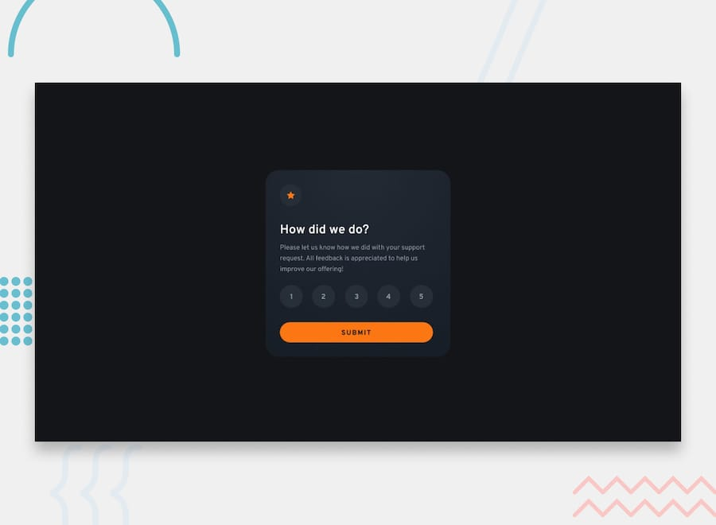

# Frontend Mentor - Interactive rating component solution

This is a solution to the [Interactive rating component challenge on Frontend Mentor](https://www.frontendmentor.io/challenges/interactive-rating-component-koxpeBUmI). Frontend Mentor challenges help you improve your coding skills by building realistic projects.

## Table of contents

- [Frontend Mentor - Interactive rating component solution](#frontend-mentor---interactive-rating-component-solution)
  - [Table of contents](#table-of-contents)
  - [Overview](#overview)
    - [Screenshot](#screenshot)
    - [Links](#links)
  - [My process](#my-process)
    - [Built with](#built-with)
    - [What I learned](#what-i-learned)
    - [Continued development](#continued-development)
    - [Useful resources](#useful-resources)
  - [Author](#author)

## Overview

### Screenshot

### Links

- Solution URL: [GitHub Repository](https://github.com/FraVelz/Frontend-Mentor/tree/main/interactive-rating-component)
- Live Site URL: [GitHub Pages](https://fravelz.github.io/Frontend-Mentor/interactive-rating-component/)

## My process

### Built with

- Semantic HTML5 markup
- JavaScript
- [Tailwind CSS v4](https://tailwindcss.com/) (Browser CDN: `@tailwindcss/browser`)
- [Overpass](https://fonts.google.com/specimen/Overpass) (Google Fonts)
- Mobile-first workflow

### What I learned

Build the rating step and the thank-you state with HTML, Tailwind, and a small amount of JavaScript, following the typical Frontend Mentor workflow.

### Continued development

Keep practicing with more Frontend Mentor challenges and refine accessibility, focus states, and responsive layout.

### Useful resources

- [Tailwind CSS](https://tailwindcss.com/)
- [Frontend Mentor](https://www.frontendmentor.io/)

## Author

- Frontend Mentor - [@Fravelz](https://www.frontendmentor.io/profile/FraVelz)
