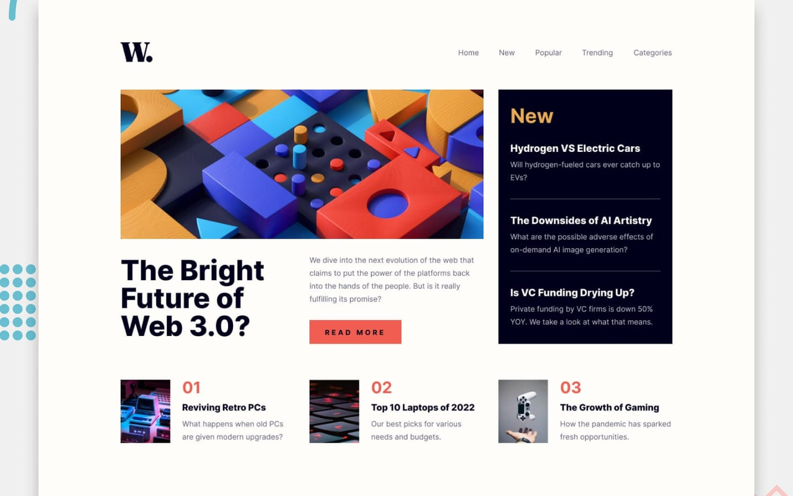

# Frontend Mentor - News homepage solution

This is a solution to the [News homepage challenge on Frontend Mentor](https://www.frontendmentor.io/challenges/news-homepage-H6SWTa1MFl). Frontend Mentor challenges help you improve your coding skills by building realistic projects.

## Table of contents

- [Frontend Mentor - News homepage solution](#frontend-mentor---news-homepage-solution)
  - [Table of contents](#table-of-contents)
  - [Overview](#overview)
    - [Screenshot](#screenshot)
    - [Links](#links)
  - [My process](#my-process)
    - [Built with](#built-with)
    - [What I learned](#what-i-learned)
    - [Continued development](#continued-development)
    - [Useful resources](#useful-resources)
  - [Author](#author)

## Overview

### Screenshot

### Links

- Solution URL: [GitHub Repository](https://github.com/FraVelz/Frontend-Mentor/tree/main/news-homepage)
- Live Site URL: [GitHub Pages](https://fravelz.github.io/Frontend-Mentor/news-homepage/)

## My process

### Built with

- Semantic HTML5 markup
- Tailwind CSS (CDN, v4 browser build) with a small `@theme` for design tokens
- Inter via Google Fonts (weights 400, 700, 800) aligned with the style guide
- Vanilla JavaScript for the mobile off-canvas navigation (`main.js`)

### What I learned

Built a responsive news-style layout with a sliding menu on small viewports, a “New” sidebar, and a ranked list section, using relative asset paths for GitHub Pages.

### Continued development

Refine focus order when opening/closing the mobile menu and add a skip link for faster keyboard access to main content.

### Useful resources

- [Inter – Google Fonts](https://fonts.google.com/specimen/Inter)
- [Tailwind CSS](https://tailwindcss.com/)
- [Frontend Mentor](https://www.frontendmentor.io/)

## Author

- Frontend Mentor - [@Fravelz](https://www.frontendmentor.io/profile/Fravelz)
