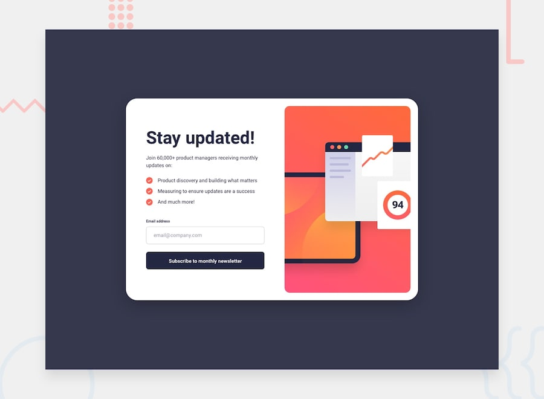

# Frontend Mentor - Newsletter sign-up form with success message solution

This is a solution to the [Newsletter sign-up form with success message challenge on Frontend Mentor](https://www.frontendmentor.io/challenges/newsletter-signup-form-with-success-message-3FC1AZbNrv). Frontend Mentor challenges help you improve your coding skills by building realistic projects.

## Table of contents

- [Frontend Mentor - Newsletter sign-up form with success message solution](#frontend-mentor---newsletter-sign-up-form-with-success-message-solution)
  - [Table of contents](#table-of-contents)
  - [Overview](#overview)
    - [Screenshot](#screenshot)
    - [Links](#links)
  - [My process](#my-process)
    - [Built with](#built-with)
    - [What I learned](#what-i-learned)
    - [Continued development](#continued-development)
    - [Useful resources](#useful-resources)
  - [Author](#author)

## Overview

### Screenshot

### Links

- Solution URL: [GitHub Repository](https://github.com/FraVelz/Frontend-Mentor/tree/main/newsletter-sign-up-with-success-message)
- Live Site URL: [GitHub Pages](https://fravelz.github.io/Frontend-Mentor/newsletter-sign-up-with-success-message/)

## My process

### Built with

- Semantic HTML5 markup
- Tailwind CSS (CDN, v4 browser build)
- Custom CSS (`styles/tw-extras.css`)
- Google Fonts (Roboto)
- Vanilla JavaScript (email validation, success view toggle)

### What I learned

Built the newsletter layout with responsive illustrations, form validation, and a success state that shows the submitted email address, aligned with the Frontend Mentor design.

### Continued development

Keep practicing with more Frontend Mentor challenges and refine accessibility and responsive design.

### Useful resources

- [Frontend Mentor](https://www.frontendmentor.io/)
- [Tailwind CSS](https://tailwindcss.com/)

## Author

- Frontend Mentor - [@Fravelz](https://www.frontendmentor.io/profile/FraVelz)
