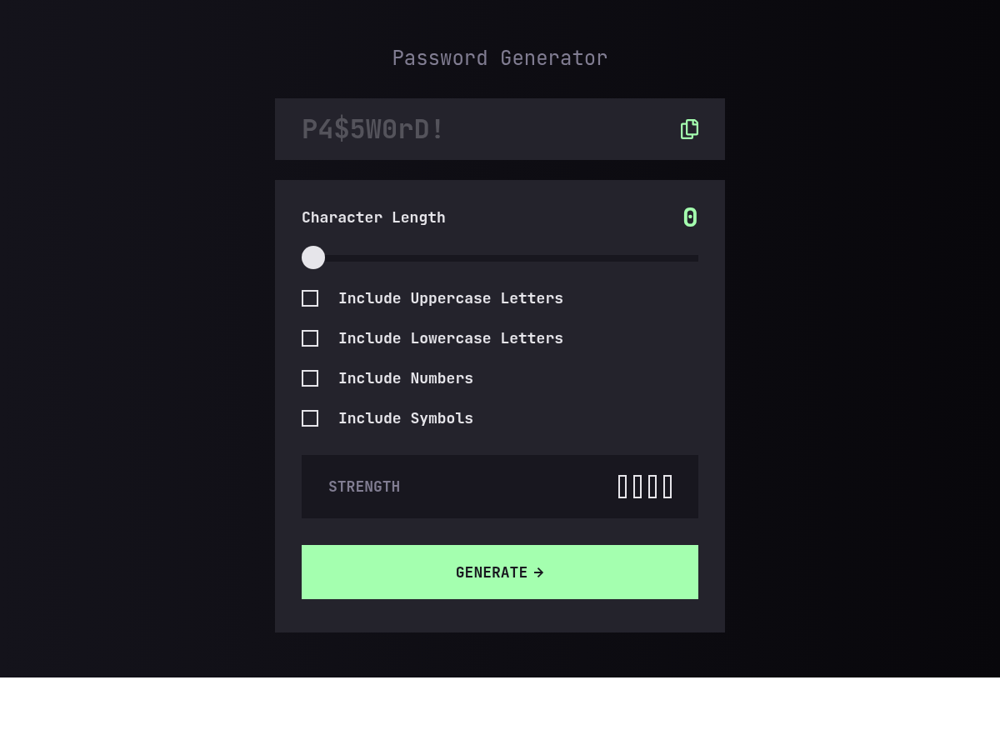

# Frontend Mentor - Password generator app solution

This is a solution to the [Password generator app challenge on Frontend Mentor](https://www.frontendmentor.io/challenges/password-generator-app-Mr8CLycqjh). Frontend Mentor challenges help you improve your coding skills by building realistic projects.

## Table of contents

- [Frontend Mentor - Password generator app solution](#frontend-mentor---password-generator-app-solution)
  - [Table of contents](#table-of-contents)
  - [Overview](#overview)
    - [Screenshot](#screenshot)
    - [Links](#links)
  - [My process](#my-process)
    - [Built with](#built-with)
    - [What I learned](#what-i-learned)
    - [Continued development](#continued-development)
    - [Useful resources](#useful-resources)
  - [Author](#author)

## Overview

### Screenshot

### Links

- Solution URL: [GitHub Repository](https://github.com/FraVelz/Frontend-Mentor/tree/main/password-generator-app)
- Live Site URL: [GitHub Pages](https://fravelz.github.io/Frontend-Mentor/password-generator-app/)

## My process

### Built with

- Semantic HTML5 markup
- Tailwind CSS (Play CDN) with custom theme (colors, JetBrains Mono)
- Extra CSS for range slider and custom checkboxes
- Vanilla JavaScript (password generation, strength logic, copy to clipboard)
- Google Fonts (JetBrains Mono)
- Mobile-first, responsive layout

### What I learned

Built a two-card flow with a read-only output field, a length slider, inclusion toggles, a strength readout, and a generate action aligned with the challenge UI.

### Continued development

Tighten accessibility (announcements, focus), keyboard behavior on the range input, and optional clipboard API fallbacks.

### Useful resources

- [Frontend Mentor](https://www.frontendmentor.io/)
- [Tailwind CSS](https://tailwindcss.com/)

## Author

- Frontend Mentor - [@Fravelz](https://www.frontendmentor.io/profile/Fravelz)
