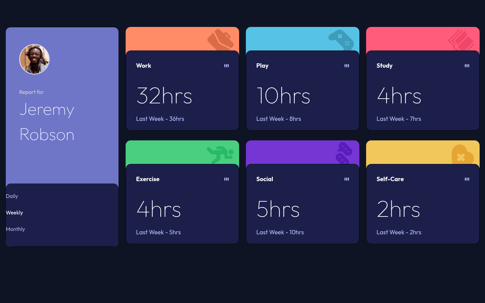

# Frontend Mentor - Time tracking dashboard solution

This is a solution to the [Time tracking dashboard challenge on Frontend Mentor](https://www.frontendmentor.io/challenges/time-tracking-dashboard-UIdef7YcA). Frontend Mentor challenges help you improve your coding skills by building realistic projects.

## Table of contents

- [Frontend Mentor - Time tracking dashboard solution](#frontend-mentor---time-tracking-dashboard-solution)
  - [Table of contents](#table-of-contents)
  - [Overview](#overview)
    - [Screenshot](#screenshot)
    - [Links](#links)
  - [My process](#my-process)
    - [Built with](#built-with)
    - [What I learned](#what-i-learned)
    - [Continued development](#continued-development)
    - [Useful resources](#useful-resources)
  - [Author](#author)

## Overview

### Screenshot

### Links

- Solution URL: [GitHub Repository](https://github.com/FraVelz/Frontend-Mentor/tree/main/time-dashboard-main)
- Live Site URL: [GitHub Pages](https://fravelz.github.io/Frontend-Mentor/time-dashboard-main/)

## My process

### Built with

- Semantic HTML5 markup
- Tailwind CSS (CDN, v4 browser build)
- Google Fonts (Outfit)
- Mobile-first, responsive layout

### What I learned

Built a multi-card dashboard with a profile and time-filter panel, category strips, and content blocks for current and previous period stats, following the Frontend Mentor design.

### Continued development

Keep practicing with more Frontend Mentor challenges and refine accessibility, interactive period switching, and responsive grid behavior.

### Useful resources

- [Frontend Mentor](https://www.frontendmentor.io/)
- [Tailwind CSS](https://tailwindcss.com/)

## Author

- Frontend Mentor - [@Fravelz](https://www.frontendmentor.io/profile/Fravelz)
